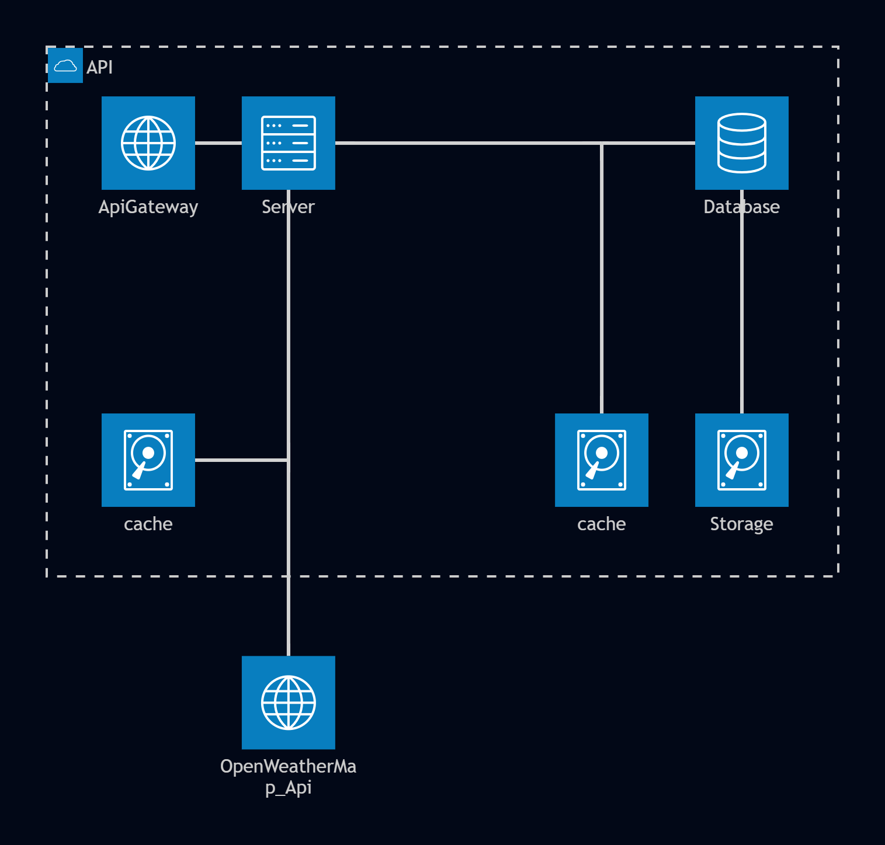
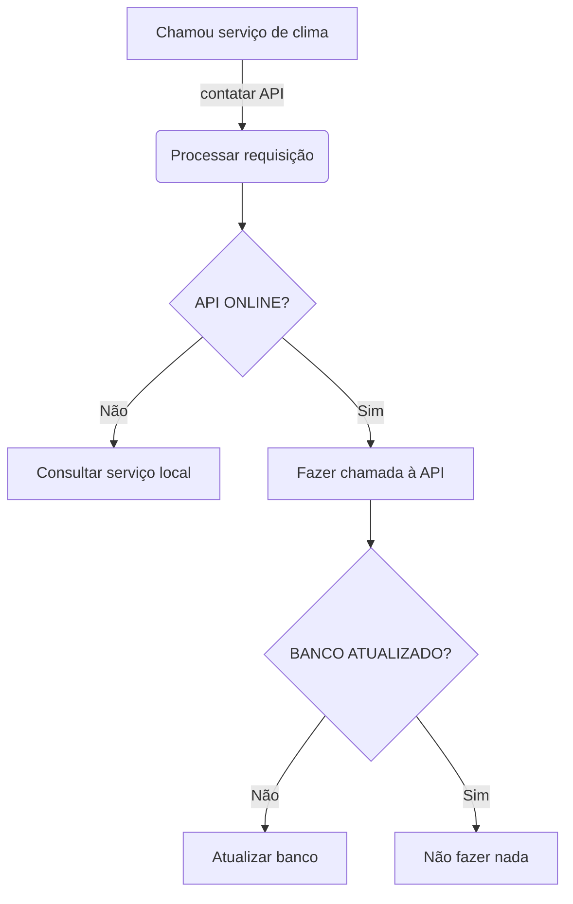
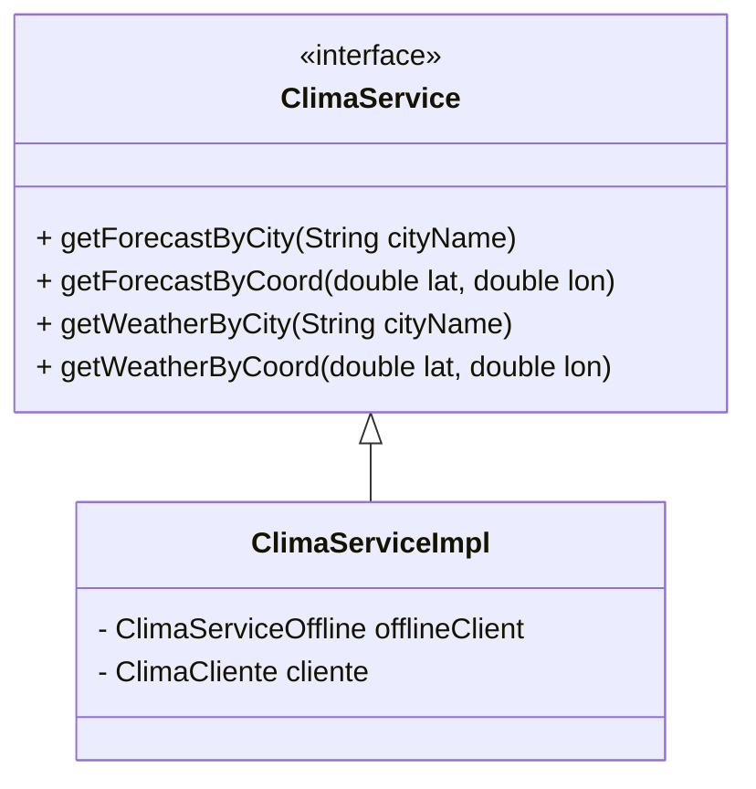
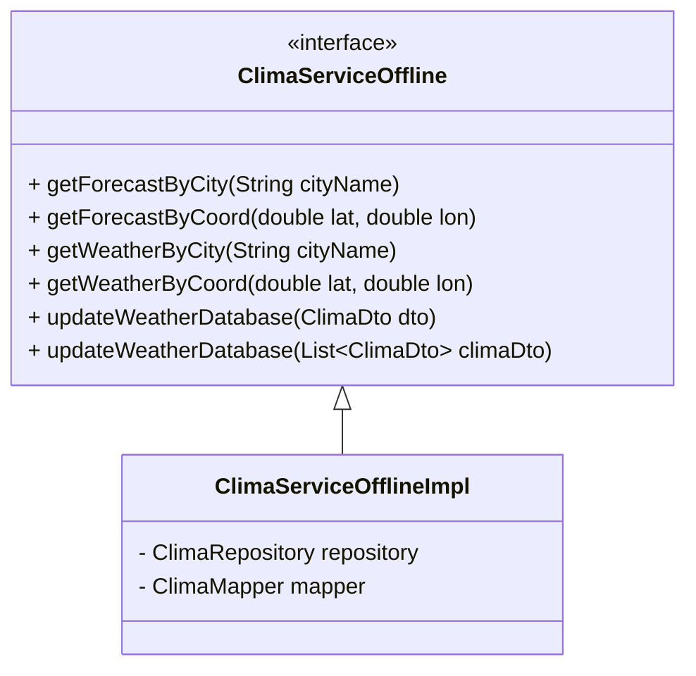
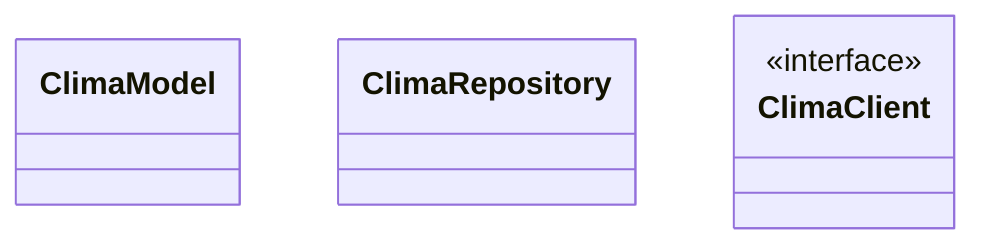
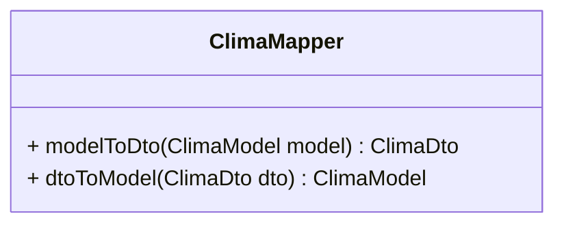

# 🌤️ Weather App

Aplicação fullstack de clima com integração à API OpenWeatherMap, persistência local e cache inteligente.

---
## Equipe responsavel

- [Arthur Victor](https://github.com/ArthurVictor42)
- [Breno luis](https://github.com/BrenoMoura00)
- [Elison oliveira](https://github.com/elison-oliveira)
- [Kauã Santiago](https://github.com/KauaS4ntiago)
- [Wagner](https://github.com/Wagner0135)
- [William rodrigues](https://github.com/Bobonimo111)


---

## 📋 Índice

- [Requisitos](#requisitos)
- [Requisitos Adicionais](#requisitos-adicionais)
- [Tecnologias](#tecnologias)
- [Arquitetura](#arquitetura)
- [Lógica Básica - Manutenção de Banco](#lógica-básica---manutenção-de-banco)
- [Classes](#classes)

---
## Como rodar a aplicação
> Para executar o back-end 
```shell
> docker-compose up -d
```
> Execução do front-end
```shell
> npm i
> npm run dev 
```


## Requisitos da aplicação

- A aplicação deve conter uma integração com API e salvar os dados de forma local.
- A aplicação deve conter no mínimo **3 design patterns**.
- A aplicação deve conter os conceitos de **SOLID**.
- A aplicação deve conter um **banco de dados**.
- A aplicação deve conter um **Front end** em qualquer framework ou linguagem.
- A aplicação deve conter um **Back end em Spring Boot**.

---

## Requisitos Adicionais

- O banco local deve ser atualizado, mantendo um período de **5 dias**.
- O banco local deve ser atualizado se a última informação não houver sido atualizada nas **últimas 12 horas**.

---

## Tecnologias

| **Infra** | **Back end** | **Front end** |
|-----------|-------------|---------------|
| Docker | Spring Boot | React JS |
| Redis | Hibernate | TypeScript |
| PostgreSQL | OpenFeign | Tailwind CSS |
| | Lombok | Axios |
| | MapStruct | Lottie React |

---

## Rotas

| Método | Endpoint | Descrição | Parâmetros (Query) | Modelo de Resposta |
| :--- | :--- | :--- | :--- | :--- |
| `GET` | `/api/climas/` | Retorna o clima atual em tempo real. | `city` **ou** `lat`, `lon` | `WeatherResponse` |
| `GET` | `/api/previsoes` | Retorna a previsão detalhada (5 dias). | `city` **ou** `lat`, `lon` | `ForecastResponse` |

---

### Cases

#### 1. Clima Atual por Cidade
`GET http://localhost:8080/api/climas?city=Passira`

#### 2. Previsão por Coordenadas
`GET http://localhost:8080/api/previsoes?lat=-7.995&lon=-35.5806`


### Integração com OpenWeather

Esta API consome os dados oficiais da **OpenWeatherMap**. Os endpoints internos fazem o mapeamento das seguintes rotas externas:

* **Clima Atual:** `https://api.openweathermap.org/data/2.5/weather?lat={lat}&lon={lon}&appid={{API-KEY}}`
* **Previsão (Forecast):** `https://pro.openweathermap.org/data/2.5/forecast?lat={lat}&lon={lon}&appid={{API-KEY}}`

> Parametro "q" pode ser adicionado para buscar pelo nome da cidade [mais informações](https://openweathermap.org/api/current?collection=current_forecast#concept)

## Arquitetura

> Diagrama de arquitetura da aplicação mostrando o fluxo entre Gateway, Server, Cache, Database e API Externa.
 

---

## Lógica Básica - Manutenção de Banco



---

## Classes

### Serviço Principal de Clima



---

### Serviço Offline de Clima



> `ClimaServiceOfflineImpl` — Responsável por salvar, requisitar e atualizar os dados no banco local.

---

### Repositório, Model e Client



> `ClimaClient` utiliza o **OpenFeign Client** para comunicação com a API externa.

---

### Mapper


